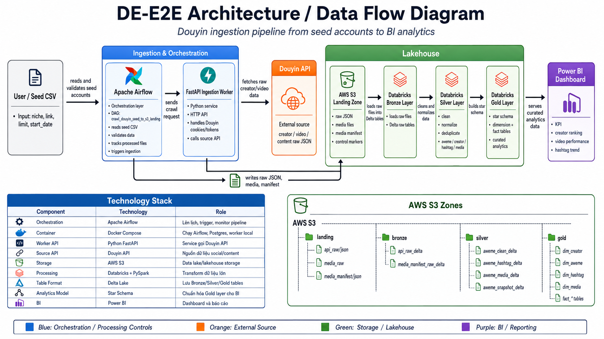
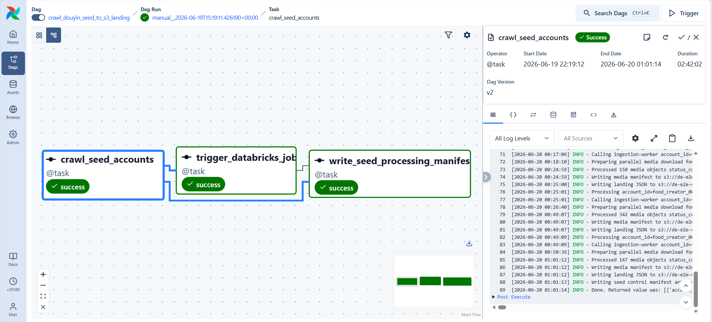
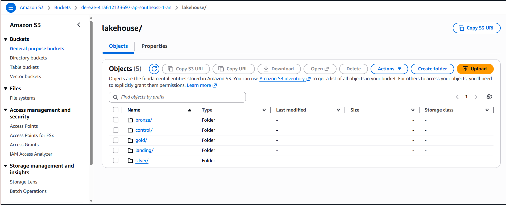
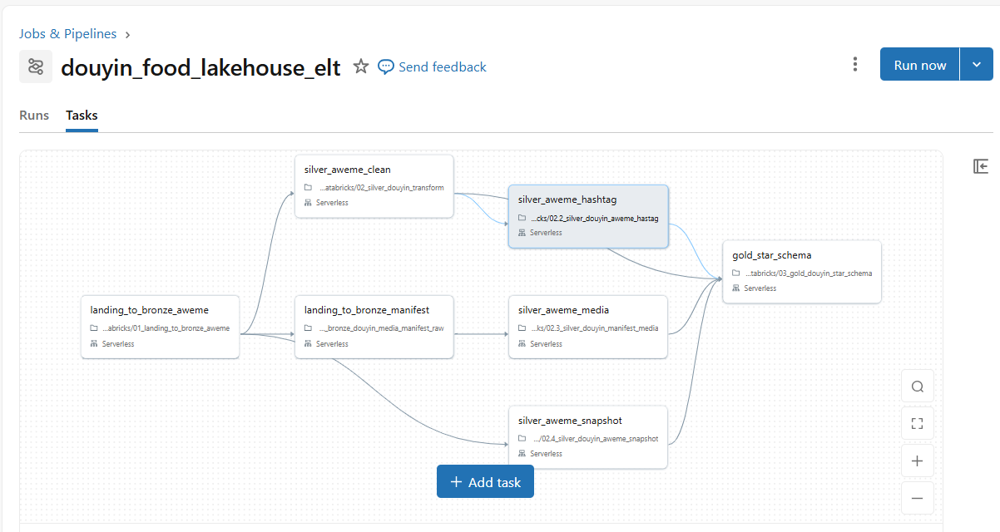
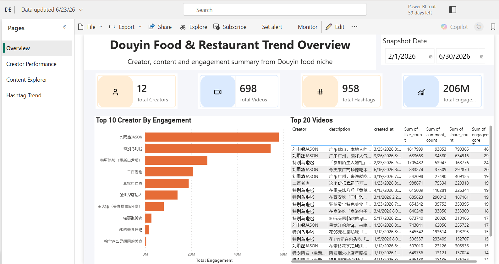

# DE-E2E — Douyin Data Engineering Lakehouse Pipeline

End-to-end Data Engineering pipeline for crawling Douyin creator data, storing raw data in S3, transforming it with Databricks Delta Lake, and serving analytics in Power BI.

> Power BI report: [https://app.powerbi.com/groups/dd7c739d-f75b-4f12-88c1-9def0db34c67/reports/d1bff2c4-11a7-4532-bdb9-5fd968316b13?ctid=de19566d-5614-4039-8605-88385b44ae04&pbi_source=linkShare](https://app.powerbi.com/groups/dd7c739d-f75b-4f12-88c1-9def0db34c67/reports/d1bff2c4-11a7-4532-bdb9-5fd968316b13?ctid=de19566d-5614-4039-8605-88385b44ae04&pbi_source=linkShare)

## Architecture



## Pipeline Flow

1. **Seed CSV**: add Douyin creator links and crawl settings under `seeds/`.
2. **Airflow**: trigger DAG `crawl_douyin_seed_to_s3_landing`.
3. **Worker API**: `ingestion-worker` fetches raw Douyin JSON and media metadata.
4. **S3 Landing**: Airflow writes raw API JSON, media files, manifests, and control markers.
5. **Databricks**: notebooks transform Landing → Bronze → Silver → Gold Delta tables.
6. **Power BI**: dashboard reads Gold data for creator, content, hashtag, and performance analytics.



## Tech Stack

| Area | Tooling | Purpose |
|---|---|---|
| Orchestration | Apache Airflow, Docker Compose | Run and monitor ingestion DAGs |
| Ingestion | Python, FastAPI | Fetch Douyin raw data |
| Storage | AWS S3 | Store raw, Delta, and control data |
| Processing | Databricks, PySpark, Delta Lake | Build Bronze, Silver, and Gold layers |
| BI | Power BI | Visualize curated Gold data |

## Repository Structure

```text
DE-E2E/
├── airflow/              # Airflow image, DAGs, and requirements
├── databricks/           # Bronze, Silver, and Gold notebooks
├── ingestion-worker/     # FastAPI worker and Douyin client
├── seeds/                # Douyin seed CSV examples
├── tools/                # Seed validation and helper scripts
├── docs/images/          # README image placeholders
├── docker-compose.yml
├── .env.example
└── README.md
```

## Quick Start

Create local environment file:

```powershell
Copy-Item .env.example .env
```

Fill AWS, S3, and `DOUYIN_*` values in `.env`. Do not commit secrets.

Initialize Airflow metadata DB:

```powershell
docker compose --profile init up airflow-init
```

Start services:

```powershell
docker compose up -d
```

Check services:

```powershell
docker compose ps
curl http://localhost:8000/health
```

Open Airflow UI: `http://localhost:8080`.

## Seed CSV

Copy sample seed file:

```powershell
Copy-Item seeds/douyin_food_restaurant_seed_accounts.csv.example seeds/upload_20260624.csv
```

Minimum columns:

| Column | Description |
|---|---|
| `niche` | Content group, for example `douyin_food_restaurant` |
| `link` | Douyin user URL |
| `limit` | Number of items to fetch; `0` means all pages returned by API |
| `start_date` | Optional start date in `YYYY-MM-DD` format |

Validate seed file:

```powershell
python tools/validate_seed_csv.py seeds/upload_20260624.csv
```

## Data Layers



| Layer | Main Paths / Tables | Purpose |
|---|---|---|
| Landing | `lakehouse/landing/douyin/api_raw/json`, `media_raw`, `media_manifest/json` | Raw source data from Douyin |
| Bronze | `lakehouse/bronze/douyin/api_raw_delta`, `media_manifest_raw_delta` | Raw Delta tables with minimal changes |
| Silver | `de_e2e.silver.douyin_aweme_clean`, hashtag, media, snapshot tables | Cleaned and normalized analytics data |
| Gold | `de_e2e.gold.dim_*`, `de_e2e.gold.fact_*` | Star schema for Power BI |

## Databricks Workflow

Run notebooks in this order:

1. `00_test_connect_with_s3.ipynb`
2. `01_landing_to_bronze_aweme.ipynb`
3. `01.2_bronze_douyin_media_manifest_raw.ipynb`
4. `02_silver_douyin_transform.ipynb`
5. `02.2_silver_douyin_aweme_hastag.ipynb`
6. `02.3_silver_douyin_manifest_media.ipynb`
7. `02.4_silver_douyin_aweme_snapshot.ipynb`
8. `03_gold_douyin_star_schema.ipynb`



## Power BI

Power BI reads the Gold layer for:

- Creator ranking and engagement analysis.
- Video/content performance trends.
- Hashtag and media availability insights.
- Daily performance reporting.

Report link: [Replace with your Power BI link](PASTE_POWERBI_LINK_HERE)



## Validation Checklist

- `python tools/validate_seed_csv.py seeds/upload_20260624.csv` returns `OK`.
- Airflow DAG `crawl_douyin_seed_to_s3_landing` finishes successfully.
- Databricks Gold tables refresh before Power BI dataset refresh.

